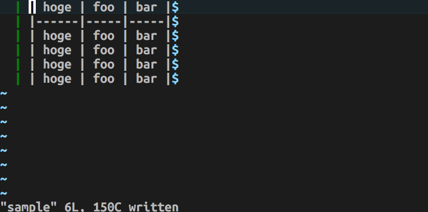
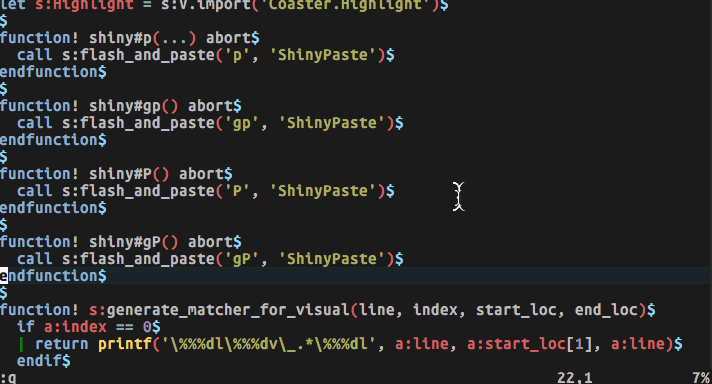

# vim-shiny

[](https://circleci.com/gh/MaxMEllon/vim-shiny)
[](github.com/vim/vim/releases/tag/v8.0.0039)
[](LICENSE.txt)
[](./doc/vim-shiny.txt)

A plugin goal is effective highlight, like as [atom-vim-mode-plus](https://github.com/t9md/atom-vim-mode-plus).

- paste yank


> with vim-operator-flashy

- if enabled `termguicolors` or `gui_running`


- change window



## Inspired

- [vim-operator-flashy](https://github.com/haya14busa/vim-operator-flashy)
- [atom-vim-mode-plus](https://github.com/t9md/atom-vim-mode-plus)

Special Thanks!

## Usage

```vim
nmap p  <Plug>(shiny-p)
nmap P  <Plug>(shiny-P)
nmap gp <Plug>(shiny-gp)
nmap gP <Plug>(shiny-gP)
```

if you want to flash when change window

```vim
let g:vim_shiny_window_change = 1
```

## TODO

- paste
  - [x] p  `<Plug>(shiny-p)`
  - [x] P  `<Plug>(shiny-P)`
  - [x] gp `<Plug>(shiny-gp)`
  - [x] gP `<Plug>(shiny-gP)`

- undo `*1`
  - [ ] u
  - [ ] U

> `*1` : Not highlight when decrease line from prev state.

- [ ] support legacy vim (for no lambda, no timer)

- [ ] dot repeat

- test
  - CI
    - [ ] win
    - [ ] mac
    - [ ] linux

- lint
  - [ ] vint
  - [ ] review dog

- configureable
  - [x] highlight group
  - [ ] highlight time

- [ ] document

LICENSE
---

MIT
